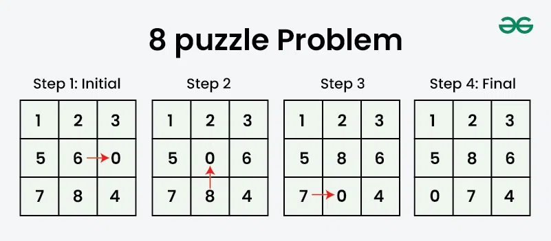
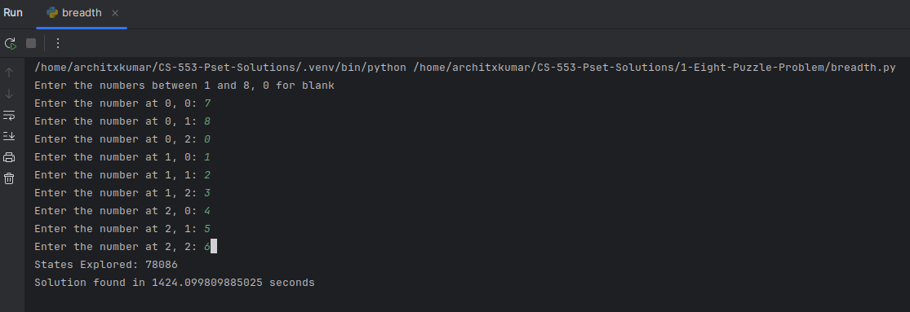
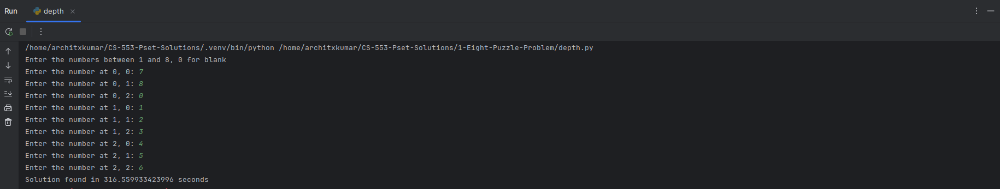

# Eight Puzzle Problem Solution

## Description
Given a 3×3 board with 8 tiles (each numbered from 1 to 8) and one empty space.
</br>
The objective is to place the numbers to match the final configuration using the empty space.
</br>
We can slide four adjacent tiles (left, right, above, and below) into the empty space.



---
## Pseudocode
```text
Open:
    index = -1
    list = []
    fn push()/queue()
    fn pop()/dequeue()
Close = []
solution = [[1,2,3],[4,5,6],[7,8,0]]

while open.list != empty:
    while True:
        n = open.pop
        if close.notContains(n):
            break
        if n == solution:
            return {time taken, states explored}
        close.push(n)
            open.push(gen_node(n))
```
---

## Solution

The solution implements uninformed search as 
- [Bread First Search](breadth.py)
- [Depth First Search](depth.py)

### Bread First Search Example



### Depth First Search Example


